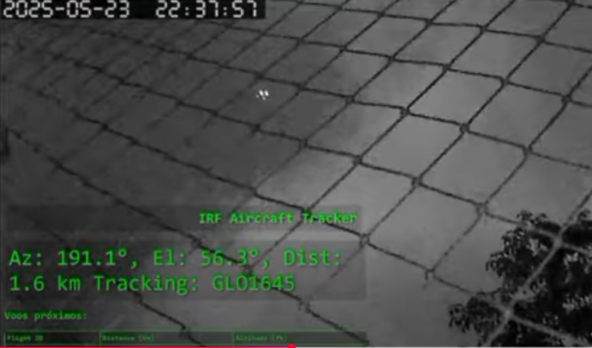
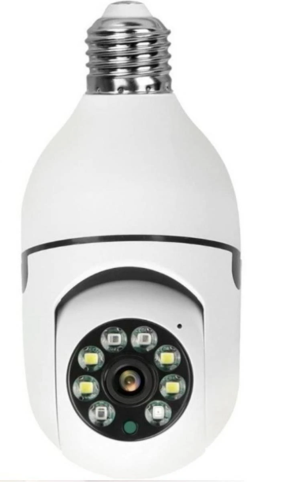
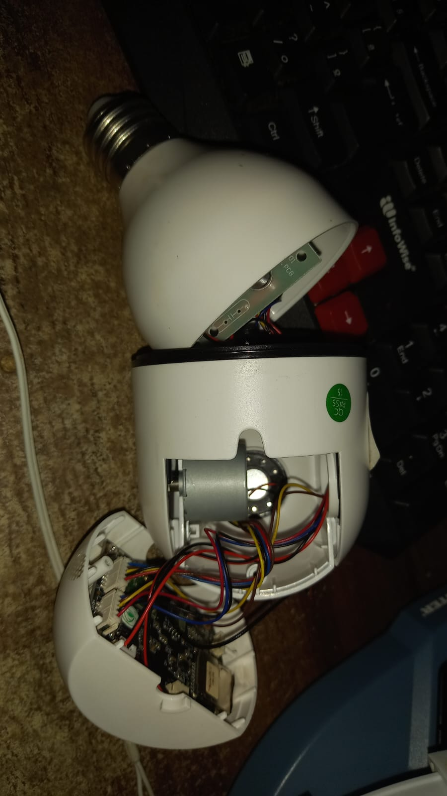
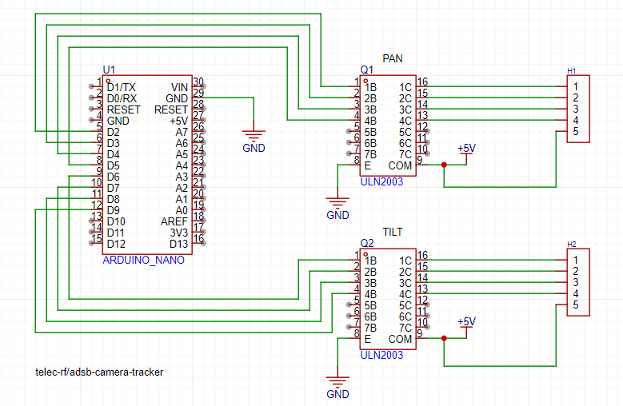

# $5 DIY ADS-B Tracking Camera

A low-cost camera tracker that follows nearby aircraft using ADS-B signals and a modified pan/tilt WiFi camera. Built with Python, a Raspberry Pi, rtl-sdr, and a unipolar stepper motor driver.

---


🎥 [Test 1 - Tracking](https://youtu.be/_JrbGSCT38Y)   https://youtu.be/_JrbGSCT38Y

🎥 [Test 2 - Tracking](https://youtu.be/yWAEASqBwnk)   https://youtu.be/yWAEASqBwnk

## Features

* Tracks nearby aircraft in real time using local ADS-B data
* Controls pan and tilt via serial commands to an Arduino Nano
* Visual status and nearby aircraft list via Flask web interface
* Uses a cheap WiFi camera with mechanical pan/tilt capability

---

## Requirements

### Hardware

* Raspberry Pi (any model with internet and USB)
* Arduino Nano (or compatible)
* ULN2003 unipolar stepper motor driver (x2)
* Pan/tilt WiFi camera (modified for serial pan/tilt control)
* 2 stepper motors (28BYJ-48 recommended)
* ADS-B receiver (e.g. RTL-SDR + dump1090-mutability)
* Cheap wifi camera with rtsp support (refer to images)

---

## 📷 Camera Modification

Before assembling the electronics, you must **modify the pan/tilt WiFi camera** to gain direct access to the internal stepper motors.

### Steps:

1. **Open the camera housing** carefully.
2. **Identify the two unipolar stepper motors** (one for pan, one for tilt).
3. **Disconnect the motor wires** directly from the internal PCB.
4. **Route the motor wires** out of the camera using a **small hole in the bottom of the housing**.
5. **Label the wires** for pan and tilt (optional but recommended).
6. **Route power supply 5v for the camera circuit**.
7. After the modification, turn the camera all the way to the left, with it facing upwards,
 and make a mark on the body below in the direction of the center of the lens, to mark the north, this point must be aligned with the real north.






📸 **Refer to the photos in the `/docs` folder** for more detail.

---

## 🧩 Arduino + Driver Wiring

The circuit consists of:

* Arduino Nano
* 2x ULN2003 stepper drivers
* 2x 28BYJ-48 stepper motors
* 5V power supply ()

🖼️ Circuit schematic:



* The camera has an internal AC to DC 5v power supply, remove it, it is not safe or prudent to leave it, power the camera board with 5V together

Make sure to power the motors with sufficient current, 1A is enough.

---

## Software Dependencies

Install these Python libraries:

```bash
pip3 install flask pyserial requests
````

Make sure `dump1090-mutability` is installed and running on the Pi to provide aircraft data.

---

## Exposing ADS-B Data Over HTTP

The script expects aircraft data from a JSON URL like:

```
http://<rpi_ip>:8080/aircraft.json
```

To serve this:

### 1. Create a symlink to aircraft.json

```bash
mkdir -p ~/web
ln -s /run/dump1090-mutability/aircraft.json ~/web/aircraft.json
```

### 2. Start a simple HTTP server

```bash
cd ~/web
python3 -m http.server 8080
```

### 3. Run Tracker.py
Adjust the parameters within the tracker.py file as necessary, especially the precise location of the camera and the altitude, so that the calculations are done correctly. Also pay attention to the good alignment of the camera's north, this ensures better captures.
Also adjust the address of your adsb server and also the correct serial port.

### 4. (Optional) Run it as a systemd service

Create `/etc/systemd/system/adsb-http.service`:

```ini
[Unit]
Description=Simple HTTP server for ADS-B JSON data
After=network.target

[Service]
ExecStart=/usr/bin/python3 -m http.server 8080
WorkingDirectory=/home/pi/web
User=pi
Restart=on-failure

[Install]
WantedBy=multi-user.target
```

Then enable and start:

```bash
sudo systemctl daemon-reexec
sudo systemctl daemon-reload
sudo systemctl enable adsb-http.service
sudo systemctl start adsb-http.service
```

---

## Arduino Sketch

Upload the Arduino sketch to your Nano before running the Python script.

The sketch receives serial commands like `p:120,t:30` (pan:120°, tilt:30°), interprets them, and moves the stepper motors accordingly using the ULN2003 driver.

Make sure to match your wiring (motor pins) and define pan/tilt limits accordingly.

The initial state of motor controller is 0 for pan and 0 for tilt, when it is turned on, the code calibrates the home point, and then levels the tilt

> **Note**: See the `/arduino` folder in this repository for the sketch.

---

## Web Interface

When running, access the live status page at:

```
http://<your_rpi_or_pc_ip>:5000/
```

It shows:

* Current azimuth, elevation, and distance
* Currently tracked aircraft ID
* A table of the 10 closest aircraft nearby
* Ready to use as overlay in obs studio for record or transmission

---

## License

GNU GPL V3. Have fun and build your own aerial tracker!
